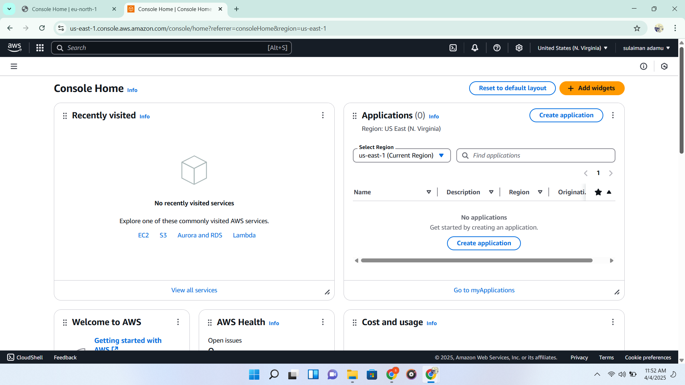

# Setting up Environment to learn DevOps

we begin by installing a couple of softwares this involve
- `Git` : for managing source code versioning.

- `Vscode` : for writing the codebase or writing test which ever case it maybe.

- `VirtualBox` : An hypervisor that allows setting up of different virtual machines.

- `MobaXterm` : to connect with online servers.

`For cloud and collaboration we will be using some online services like :`

- `Github`: allows collaboration and hosting of codebase

- `AWS` : for cloud services which am yet explore.

